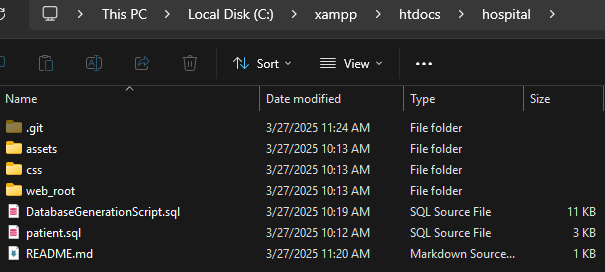
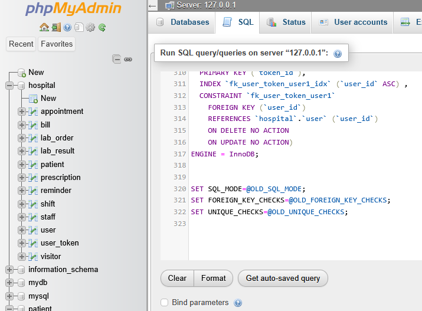
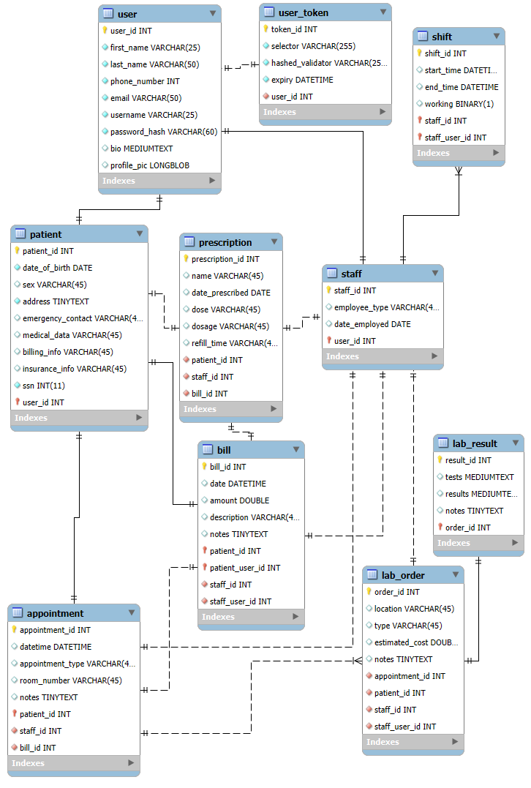

# Patient-Portal-System

Group 2: Cherish Cuttill, Andrew d'Arms, Lexi Dunsmore, Sam Richards, Jace Duckworth, Rahson Robinson

HTML, CSS, and some JS was used from https://startbootstrap.com/previews/sb-admin
Icons from https://fontawesome.com/v5/icons/x-ray?f=classic&s=solid

How to setup:
1. Install XAMPP
2. Copy project files into xampp/htdocs/hospital. The project folder should look like this (ignore .git for now):

3. Run the Apache and SQL servers in XAMPP
4. Go to PHPMyAdmin from XAMPP (Admin button next to MySQL)
5. On main page, go to SQL tab and copy the code from DatabaseGenerationScript.sql into the console, like so:

7. Hit Ctrl+Enter to run the commands, this should create the database with all appropriate tables
8. Go to localhost/hospital/web_root/login.php in your browser to access site
9. Login with the email "staff@staff.com" and the password "password" to access the test staff account
10. Login with the email "patient@patient.com" and the password "password" to access the test patient account

## GitHub Support
If you want the project to integrate with GitHub, follow these steps:
1. Download GitHub Desktop
2. From GitHub Dekstop, clone this repository to any folder
3. Navigate to that folder and cut the .git folder
4. Move the .git folder to xampp/htdocs/hospital, like so:

5. Go back to GitHub Desktop, it will now say the project has moved and cannot be found
6. Click the "Locate Project" option and navigate to xampp/htdocs/hospital
7. GitHub Desktop will now see this directory as the location of the project, so it can be updated live with GitHub commits

### Entity Relationship Diagram
Here is the ERD for the Hospital database, for reference:

